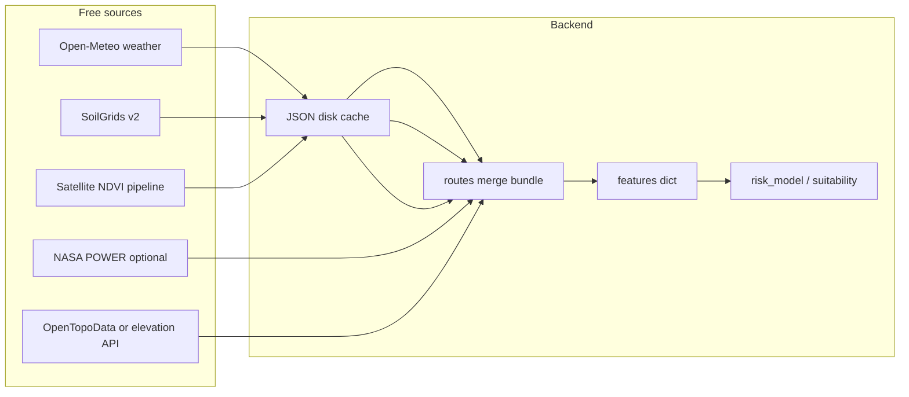

# Free NDVI, soil, and extended agronomic signals

## Current integration points

- Weather is real (Open-Meteo + cache); **NDVI and soil are still synthetic** from [`backend/app/api/routes.py`](backend/app/api/routes.py) via `_synthetic_vegetation_soil`, merged into the analyze bundle.
- The risk stub reads **`features["ndvi_current"]`, `features["ndvi_historical"]`, `features["soil_type"]`, rainfall, temp** in [`ml/risk_model.py`](ml/risk_model.py); suitability/stress logic uses the same keys in [`ml/suitability.py`](ml/suitability.py).
- [`docs/SOIL_IMPLEMENTATION.md`](docs/SOIL_IMPLEMENTATION.md) already documents **ISRIC SoilGrids v2** `classification/query` → map WRB names to `Sandy` / `Clay` / `Loam` for the model.

---

## 1. Real soil types (free): SoilGrids v2

**Feasibility: high.** ISRIC **SoilGrids** REST is **free** (check current [SoilGrids data policy](https://www.isric.org/explore/soilgrids/) for attribution/terms). No API key for basic use in many setups.

**Implementation shape:**

- Add a small service e.g. `backend/app/services/soil_grids.py` that calls `classification/query` (and optionally `properties/query` for sand/clay/silt at depth) for `(lat, lon)`.
- **Map WRB class strings** to your existing buckets (`Sandy`, `Clay`, `Loam`) using an explicit table (expand beyond the three `if "Arenosols"` lines in the doc—add Vertisols, Luvisols, etc., with a default `Loam`).
- **Cache** responses keyed by rounded lat/lon + TTL (same pattern as [`backend/app/services/weather_cache.py`](backend/app/services/weather_cache.py)) to respect rate limits and speed up repeats.
- **Expose provenance** in API JSON: e.g. `soil_source: "soilgrids_v2"` vs fallback `synthetic` / `error`.

**Accuracy caveat:** Point queries sample a grid (~250 m); fine for demo risk, not a substitute for field soil tests.

---

## 2. Real NDVI / vegetation (free): choose one pipeline

**Feasibility: medium** (free yes; **operational complexity** is the constraint—there is rarely a single “NDVI at lat/lon” button without processing).

| Approach | Cost | Pros | Cons |
|----------|------|------|------|
| **MODIS VI (MOD13Q1 / MYD13Q1)** via NASA **AppEEARS** or LAADS subset | Free | Global, stable 16-day composites; good for “current vs ~same period last year” historical delta | Async jobs or heavier workflow; not instant for every HTTP request without pre-caching |
| **Sentinel-2 L2A** via public **STAC** (e.g. Element84 Earth Search, Microsoft Planetary Computer) + local NDVI | Free | High spatial resolution | Need raster stack + cloud mask + median/mean in a buffer; adds **rasterio/stackstac**-class deps and CPU |
| **Google Earth Engine** (Python `ee`) | Free for noncommercial/research with signup | One-stop NDVI time series | Account + quota; extra auth in deployment |
| **Open-Meteo “satellite”** | Free if available | Same client as weather | **Must verify** whether their public API exposes NDVI/EVI for your bbox—do not assume without checking their docs |

**Recommended plan for TerraGuard:**

1. **Define NDVI semantics** to match the model: e.g. `ndvi_current` = latest valid composite in last 30 days; `ndvi_historical` = composite from **same calendar window one year ago** (or prior year same MODIS period index)—document this in the API so scores are interpretable.
2. **Pick one**: **MODIS** (simpler semantics globally, coarser resolution) **or** Sentinel-2 (finer, harder ops). For a hackathon backend, **MODIS + disk cache + scheduled or lazy fetch** is usually easier than per-request Sentinel processing.
3. **Fallback chain**: real NDVI → last cached → synthetic seed (current behavior) so analyze responses stay stable offline.

---

## 3. Reference ET / evapotranspiration

**Feasibility: high for reference ET inputs or PET.**

- **FAO-56 Penman–Monteith “reference ET”** needs daily radiation, wind, humidity, min/max temp. You already have temps/rain from Open-Meteo; **gaps** are radiation/wind—**NASA POWER** ([POWER API](https://power.larc.nasa.gov/docs/services/api/)) provides **free** daily meteorology globally suitable for computing or approximating reference ET (verify parameter names/versions in their docs).
- **Satellite ET products** (e.g. SSEBop, WaPOR): often **regional** (WaPOR Africa/MENA-heavy) or heavier to subset—feasibility **medium**, not universal.

**Model hook:** Add features such as `ref_et_mm_day`, `rain_minus_ref_et_30d` (water balance stress), and optionally down-weight pure rainfall rules when ET is available. Keep Open-Meteo-only path when POWER fails.

---

## 4. Soil moisture (SMAP, Sentinel-1 proxies, sensors)

**Feasibility: medium.**

- **NASA SMAP L3/L4**: **Free** science data; **subsetting** to a point/bbox is doable via **NASA Earthdata** services or batch tools—not as trivial as a single REST “sm at lat/lon” for all deployments (often needs Earthdata login).
- **Sentinel-1 soil moisture proxies**: **Free** but requires SAR processing or external derived products—**high engineering** cost.
- **Local sensors**: accurate per-field but **not scalable** unless users upload readings—optional future input.

**Model hook:** `soil_moisture_index` 0–1 or percentile vs climatology; use as modifier alongside rainfall (closer to plant-available water than rain alone).

---

## 5. Elevation / slope / hydrology (DEM)

**Feasibility: high for elevation and slope; medium for “hydrology”.**

- **OpenTopoData** / **Open-Elevation**-style APIs: **free** tier with rate limits—good for **elevation** at a point.
- **Slope**: compute from a small DEM tile (e.g. Copernicus DEM or SRTM via static raster fetch + `numpy` gradient) or use a precomputed terrain service if you accept dependency on third-party uptime.
- **Cold-air pooling / drainage class**: derive coarse rules from slope + elevation relative to neighborhood (needs a slightly larger DEM patch)—feasibility **medium**, still explainable in a demo.

**Model hook:** `elevation_m`, `slope_deg`, optional `tri` or `position_index` for cold pooling risk in suitability text and risk score tweaks.

---

## 6. Growing Degree Days (GDD)

**Feasibility: high.** You already have/historical daily temps from Open-Meteo (archive + forecast). Implement **base-temperature GDD** per crop from [`backend/app/services/crop_catalog.py`](backend/app/services/crop_catalog.py) profiles (e.g. base 10 °C for maize).

**Model hook:** `gdd_accum_season` or `gdd_30d` with planting window assumptions (see below); adjust heat stress and phenology narrative.

---

## 7. Pests / disease risk layers

**Feasibility: low for automated global accuracy.** Most extension models are **PDFs, maps, or state-specific portals**, not uniform JSON APIs. Practical approach:

- **Phase A:** Static **region × crop × month** risk flags from curated public bulletins (manual table), driven by **country/ADM** from reverse geocode or user selection—not live raster layers.
- **Phase B:** If targeting one country, integrate that region’s open APIs if any (rare).

Use as **soft signals** in Watsonx narrative and low-weight suitability flags, not hard numeric calibration without validation.

---

## 8. Crop calendar / planting windows (variety-specific GDD)

**Feasibility: medium.** Encode **planting window** and **GDD-to-maturity** ranges as **static tables** (USDA/variety sheets or crop profiles)—no universal free API for all crops globally.

**Model hook:** Compare current date + forecast GDD trajectory to window; emit suitability reasons (“inside/outside typical window”).

---

## 9. Historical yields / county statistics (calibration)

**Feasibility: high for **US** county crops via **USDA NASS Quick Stats** API (open data); **medium** for other countries (FAO FAOSTAT is national/agglomerated, not always county).

Use **not** as live per-field yield but to **scale or sanity-check** risk scores (“relative to county typical volatility”) and for demo credibility—e.g. fetch county yield trend when lat/lon resolves to US county.

---

## Suggested implementation order

1. **SoilGrids + cache + WRB mapping** (fast win, aligns with existing doc).
2. **GDD from existing weather series** (pure code, no new external dependency).
3. **NASA POWER** subset for radiation/wind → **reference ET** or rain-minus-ET balance (extends water stress beyond rainfall).
4. **NDVI pipeline** (MODIS or Sentinel-2) with aggressive caching and clear `vegetation_source`.
5. **DEM elevation + simple slope** from a free elevation/DEM path.
6. **SMAP or soil moisture** if Earthdata access is acceptable for your deployment story.
7. **USDA yield calibration** for US demos; **static pest/calendar tables** as narrative enrichers.

## Files likely touched (later implementation)

- New: `backend/app/services/soil_grids.py`, `vegetation_modis.py` (or `ndvi_stac.py`), optional `nasa_power.py`, `terrain.py`, `gdd.py`.
- Extend: [`backend/app/api/routes.py`](backend/app/api/routes.py) merge and feature assembly; [`ml/risk_model.py`](ml/risk_model.py) / [`ml/suitability.py`](ml/suitability.py) only when new keys are stable and backward-compatible defaults exist.
- Cache dir / `.gitignore` patterns mirroring weather cache.

## Risks to flag

- **Rate limits and 429s** (same class of issue as Open-Meteo)—always cache and degrade gracefully.
- **License/attribution**: SoilGrids, NASA products, Copernicus DEM—surface short attribution strings in docs or API metadata.
- **Scope creep**: Sentinel-1 moisture and full pest APIs can dominate the project; keep them **behind clear phases**.
