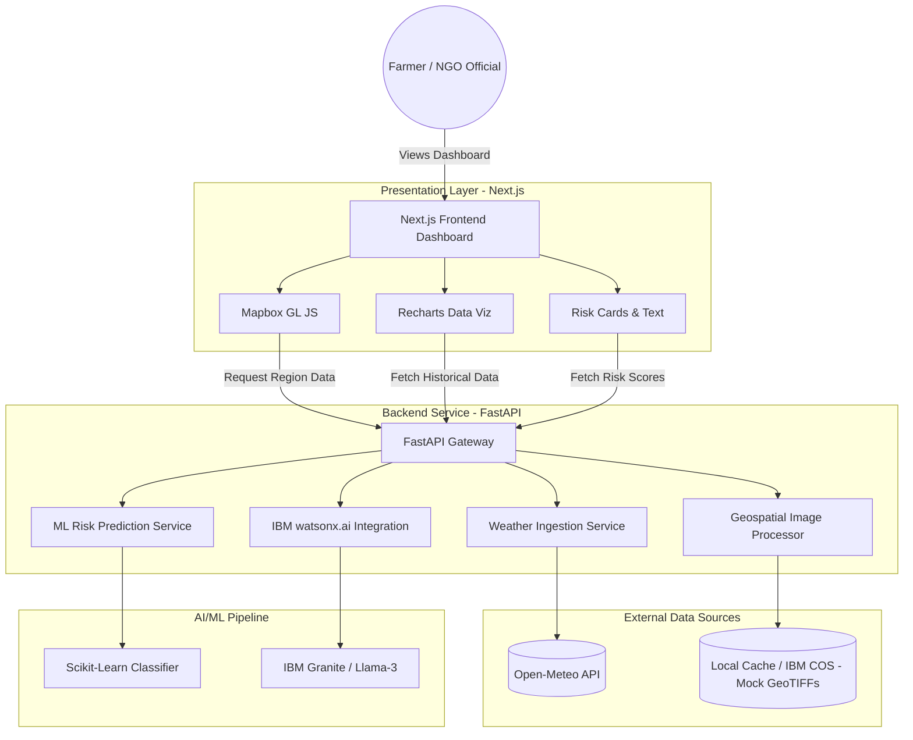

# System Architecture

GrowSpot is designed as a modular, scalable, yet lightweight application optimized for the IBM x UNSA Hackathon timeframe. It follows a classic client-server architecture with decoupled microservices for AI inference and external data ingestion.

## High-Level Architecture Diagram

## Component Breakdown

### 1. Presentation Layer (Next.js)
*   **Role**: Handles all user interactions, state management, and geospatial rendering.
*   **Tech Stack**: Next.js 14, React, Tailwind CSS, TypeScript, Mapbox GL JS (via `react-map-gl`), Recharts.
*   **Key Responsibilities**:
    *   Render the interactive map.
    *   Overlay heatmap layers representing risk.
    *   Display human-readable insights.

### 2. API & Aggregation Layer (FastAPI)
*   **Role**: Acts as the central nervous system. Routes requests, handles caching, and aggregates disparate data formats.
*   **Tech Stack**: Python 3.10, FastAPI, Uvicorn, Pydantic.
*   **Key Responsibilities**:
    *   Expose clean REST endpoints to the frontend.
    *   Align temporal data (e.g., matching daily rainfall with weekly NDVI).

### 3. Data Ingestion Services
*   **Open-Meteo**: Provides historical, current, and forecasted weather data (precipitation, temperature, soil moisture) without rate limits.
*   **Geospatial Data (GeoTIFFs)**: For the hackathon demo, high-resolution NDVI (Normalized Difference Vegetation Index) data is simulated and cached locally. This guarantees 100% uptime and sub-second rendering for the presentation.

### 4. Machine Learning Services
*   **Risk Model**: A lightweight Python ML model (e.g., Random Forest or Logistic Regression) processes the aggregated array of [Temperature, Rainfall, NDVI Drop] to predict a discrete "Crop Stress Score".
*   **Generative Insights**: IBM watsonx.ai is used as a generative layer. Raw numeric outputs and risk scores are passed into an IBM hosted LLM to generate plain-text, contextual advice for the end-user.

## Data Flow
1.  **Selection**: User clicks on a farm region polygon on the Mapbox UI.
2.  **Request**: Frontend sends coordinates `(lat, lon)` to the FastAPI backend.
3.  **Fetch**: FastAPI concurrently requests 30-day weather data from Open-Meteo and extracts the average NDVI from the cached GeoTIFF.
4.  **Inference**: The aggregated features are passed into the `predict()` function of the risk model.
5.  **Generation**: The metrics and the resulting risk score are passed as a prompt to `watsonx.ai` to get a human-readable insight.
6.  **Response**: The compiled JSON payload is returned to the frontend.
7.  **Render**: The dashboard updates charts, colors the polygon, and displays the text insight.
